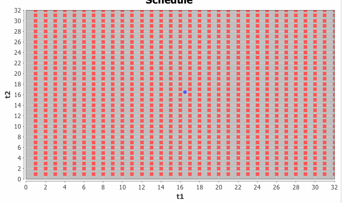
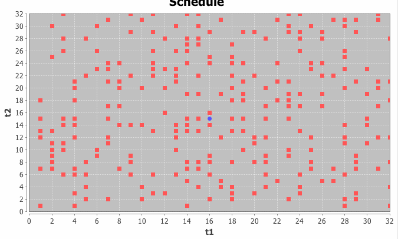
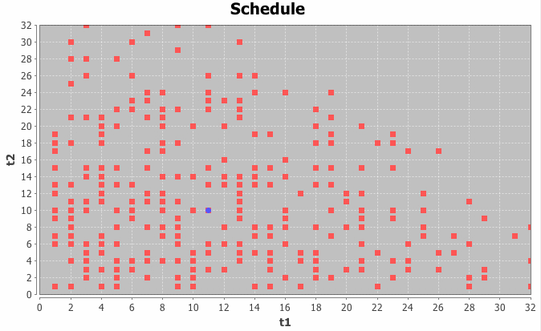

## NMRPyStar ##

A Python library for generating non-uniform NMR sample schedules.

## What is non-uniform sampling? ##

Non-uniform sampling can be used to:
 1. reduce spectrometer time
 2. increase sensitivity, where sensitivity is the ability to detect weak peaks
 3. increase resolution

Uniform sampling requires FID collection at uniformly spaced
time delays in the indirect dimensions.  The following example is a representation
of the collection scheme used in a uniformly sampled experiment; there are two
indirect dimensions (the direct dimension is not shown), and the two axes represent
time delays along the indirect dimensions.  Each red point indicates FID collection
in the direct dimension:

Non-uniformly sampled spectra do not necessarily collect FIDs at all grid points,
as in the following example:

Sample schedules can be more effective when they take into account prior knowledge of
the sample; for example, if you're looking at decaying sinusoids, a schedule biased
towards earlier time increments will have better sensitivity:

On the other hand, collecting some points at later time intervals is important for
good resolution.

## What else can be non-uniform? ##

In addition to time delays, other aspects of data collection can be manipulated to 
improve spectral characteristics:

 - number of transients.  Increasing the number of transients can improve sensitivity,
   if the signal is strong.  On the other hand, increasing the number of transients
   for time delays past the Rovnyak limit may hurt sensitivity.  By collecting differing
   numbers of transients -- more at short delays and fewer at long delays, sensitivity 
   can be improved without losing resolution.
 
 - quadrature.  When an FID is collected, there are two components:  the "real" and 
   the "imaginary" quadrature components.  When a two dimensional experiment is
   collected, there are now four quadrature components:  "real/real", "real/imaginary",
   "imaginary/real", "imaginary/imaginary".  The number of components grows by a power
   of 2 per indirect dimension.  This greatly contributes to the increased amount of 
   time required by multidimensional experiments.  However, it is not necessary to 
   collect every quadrature component in order to determine phase; see "Random phase 
   detection in multidimensional NMR", PNAS, 2011 for more details.
   

## Okay, I want to do non-uniform sampling.  Now what? ##

You'll need to tell the spectrometer when to collect data.  That's where this project
comes in to play -- it includes a variety of algorithms for generating sample schedules
that are non-uniform in any/all of time delays, number of transients, and quadrature
components, and also formats the schedules properly for the different spectrometer
companies and non-uniform processing tools.

## References ##

For more information about processing of non-uniformly collected data and creating
sample schedules, see papers by Hoch, Stern, Wagner, Hyberts, or Orekhov.

### Contact information ###

Found a bug?  Need help figuring something out?  Want a new feature?  Feel free
to report anything using the github issue tracker, or email me directly at
mfenwick100 at gmail dot com
